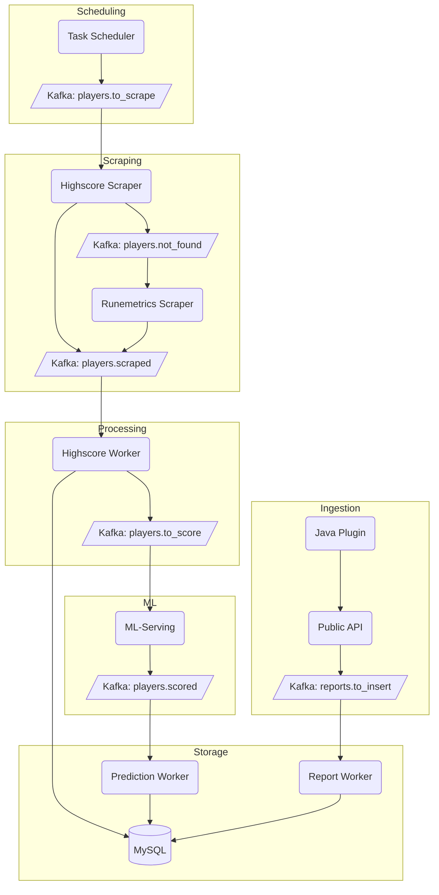

# Setup

## Requirements
- [Docker](https://docs.docker.com/desktop/setup/install/linux/)
- [uv](https://docs.astral.sh/uv/getting-started/installation/)
- api key: [Webshare](https://www.webshare.io/?referral_code=qvpjdwxqsblt)

## General Setup

1. create an .env file from the .env.example contents
2. Build and start the Docker container:
    this will restart the docker compose file and create the entire project including mysql-database & kafka-queue
    ```sh
    make docker-restart
    ```
    or if you want to exec into a debug container and run the code
    ```sh
    make docker-dev-restart
    ```
## Other Setup
### Web Scraper

1. Generate an API key from [Webshare](https://www.webshare.io/?referral_code=qvpjdwxqsblt).
2. Copy the contents of `.env.example` to a new `.env` file.
3. Replace `<api key>` in the `.env` file with your API key:

    ```env
    PROXY_API_KEY="<api key>"
    ```

# Project Standards
## Definitions
- **Business logic**: the rules that determine how the domain behaves; validations, decisions, orchestration of use-cases, state transitions, etc.
- **Plumbing**: transport/infrastructure glue (HTTP routing, request parsing, wiring dependencies) that carries inputs to the correct business logic and returns the result.
- **Feature**: a cohesive capability (feedback reporting, player scraping, proxy rotation, etc.) that owns its domain rules, ~~DTOs~~ structs, ports, and integrations. Each feature lives inside a component so it can be reused by multiple bases/projects without duplication.
- **Models** = SQLAlchemy ORM classes mapped to concrete tables (live under `components/bot_detector/database/**/models`). Only the persistence layer (repositories/adapters that talk to storage) should touch them.
- **Structs** = Pydantic data shapes (requests/responses/contracts) shared across components/bases; they live under `components/bot_detector/structs` and replace the old “DTO” term.

## Working Standards
- **Components** encapsulate each feature’s business logic plus adapters, and may depend on other components/libraries only.
- **Bases** expose public APIs and handle plumbing only (routing, request parsing, dependency wiring) before delegating to components.
- **Projects** only compose bricks + libraries into deployable artifacts; they hold wiring/config, never feature code.
- **Shared structs** (DTOs, interfaces) belong in reusable components like `components/bot_detector/structs` so every base/project can import them without circular dependencies.
- **Tests** live under the workspace-level `test/` directory via `[tool.polylith.test]`, so base/component fixtures and contract tests should be added there rather than inside each brick folder. Add per-base `resources/` directories only when a base needs static assets or config that isn’t shared elsewhere.

# The Polylith Architecture
## Overview
The Polylith architecture is a modular approach to organizing codebases, aimed at improving maintainability, reducing duplication, and providing better oversight of projects. It is particularly well-suited for managing large, complex applications.

### Why Use Polylith?
1. **Reduce Duplication**: With many repositories, schemas and functionalities are often replicated, leading to inconsistencies and maintenance challenges. Polylith consolidates shared code into reusable components.
2. **Improve Oversight**: Managing multiple repositories can obscure the overall project structure. Polylith centralizes the architecture, making it easier to navigate and understand.
3. **Streamline Onboarding**: New developers can quickly understand the project structure without needing to navigate numerous repositories.

## Documentation
For an in-depth guide on Polylith architecture, visit the [Polylith Documentation](https://davidvujic.github.io/python-polylith-docs/).

## Commands
Below are the essential commands for working with Polylith in your project.

### Create a Base
A base serves as the foundation for your architecture, often containing shared logic or configurations.

```sh
uv run poly create base --name <base_name>
```
### Create a Component
A component is a reusable, self-contained module that encapsulates specific functionality.
```sh
uv run poly create component --name <component_name>
```

### Create a Project
A project is the entry point for your application, built using the base and components.
```sh
uv run poly create project --name <project_name>
```
# design


# intersting commands
```sh
find . -type f -name "pyproject.toml" -not -path "*/.venv/*" -execdir sh -c 'echo "🔄 Updating lock in $(pwd)"; uv lock' \;
```
```sh
find . -type f -name "pyproject.toml" -not -path "*/.venv/*" -execdir sh -c 'echo "🔄 syncing in $(pwd)"; uv sync' \;
```
```sh
find . -type f -name "pyproject.toml" -not -path "*/.venv/*" -execdir sh -c 'echo "🔄 Removing venv in $(pwd)"; rm -rf .venv/' \;
```
```sh
find . -type f -name "pyproject.toml" -not -path "*/.venv/*" -execdir sh -c 'echo "🔄 Removing Dockerfile.bak in $(pwd)"; rm Dockerfile.bak' \;
```