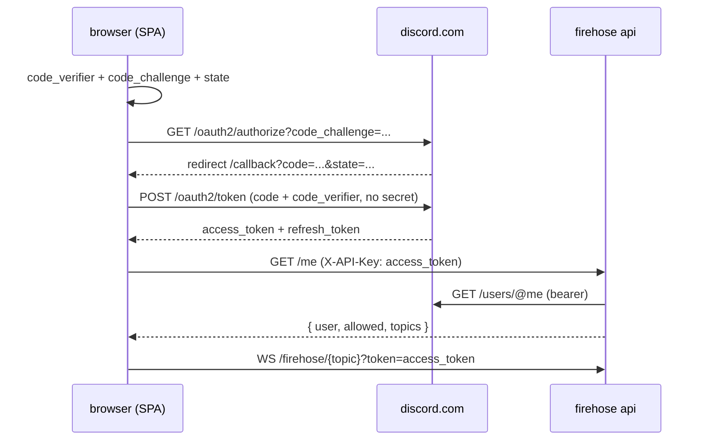

# firehose frontend

Manual test + showcase client for the firehose websocket. Not a brick and
not a container: plain React (vite + tailwind), run with npm on the host,
talking to the firehose API.

## Architecture

Authentication is fully client-side with OAuth2 + PKCE. The user's
browser owns the tokens: it starts the login, exchanges the code, stores
access + refresh tokens, and refreshes before expiry. The firehose API
holds no client secret and never issues tokens; on every request it only
validates the presented Discord access token:

1. token is live -> GET `discord.com/api/v10/users/@me`
2. user is allowlisted -> active `apiUser` row
   (`username = discord_<id>`)
3. identity + allowed topics -> returned to the client



The PKCE flow needs only a public client id; Discord supports PKCE
(S256) without a client secret even though it is barely documented.

## Setup

1. Register a Discord application: https://discord.com/developers/applications
2. OAuth2 -> add redirect: `http://localhost:5173/callback`
3. Client id: `.env.example` ships the default (`825139932817129613`).
   Copy it, or override with your own application id:

```sh
cp .env.example .env  # ships a working default VITE_DISCORD_CLIENT_ID
```

## Run

```sh
npm install
npm run dev
```

Open http://localhost:5173. Default proxy target is
http://localhost:5000 (a locally running firehose API). Override with:

```sh
# against the compose-dev stack (firehose mapped to localhost:8000)
FIREHOSE_URL=http://localhost:8000 npm run dev

# against any other api, e.g. the live endpoint
FIREHOSE_URL=https://firehose.osrsbotdetector.com npm run dev
```

The vite dev server proxies `/firehose` and `/me` to the API, so the app
is same-origin (no CORS setup). `/callback` is served by the SPA; it is
the redirect target registered in the Discord application.

## Endpoint

The API endpoint is selectable in the UI (preset dropdown + free-form
input): the dev proxy default, `localhost:5000`,
`localhost:8000` (compose dev), and the live
`https://firehose.osrsbotdetector.com`. A custom value can be typed;
press Enter or leave the field to apply. The choice is persisted in
`localStorage` and survives reloads; the default comes from
`VITE_FIREHOSE_URL` (see `.env.example`).

`""` (dev proxy) keeps every request same-origin. An explicit URL is
called directly by the browser (cross-origin); the api answers with
CORS headers (`CORS_ORIGINS` setting, default any origin, GET +
`X-API-Key` only), so `/me`, `/firehose/topics` and the websocket all
work against localhost and live alike. The Discord PKCE login is
independent of the api endpoint — the redirect stays on the SPA
origin.

## Flows

- **anonymous** – connect without a credential (`?anonymous=1`), shared consumer group
- **discord login** – client-side PKCE (`src/discordAuth.js`); tokens live in
  `localStorage`, auto-refresh happens before expiry and on demand

## API contract

- `GET /me` with `X-API-Key` (no credential = anonymous):

```json
{ "user": "discord_123456789012345678", "token": "...", "allowed": true, "topics": ["players.scraped"] }
```

`allowed=false` means the credential was rejected. `user` is then
`null` (invalid discord token) or the known discord id (registered
check failed, not allowlisted). `topics` lists every topic the
identity may consume with a key; anonymous identities get every
topic (shared consumer group).

- `WS /firehose/{topic}?token=<access_token>` or `?anonymous=1`;
  non-browser clients may send `X-API-Key` instead. The websocket
  still enforces the `firehose.<topic>` permission per connection.

In Swagger UI (`/docs`) use the Authorize button to set `X-API-Key`;
"try it out" then sends the credential on `/me`.

Allowlisting a user is a DB step outside this stack; see
`_infra/_mysql/docker-entrypoint-initdb.d/01_tables.sql`.

## MVP examples

Minimal client-side PKCE against Discord, in both languages. Same
contract: the client holds and refreshes tokens, the API only validates.

### TypeScript

```ts
const CLIENT_ID = import.meta.env.VITE_DISCORD_CLIENT_ID;
const AUTHORIZE_URL = "https://discord.com/oauth2/authorize";
const TOKEN_URL = "https://discord.com/api/oauth2/token";

const b64url = (bytes: Uint8Array) =>
  btoa(String.fromCharCode(...bytes))
    .replace(/\+/g, "-")
    .replace(/\//g, "_")
    .replace(/=+$/, "");

async function pkce() {
  const verifier = b64url(crypto.getRandomValues(new Uint8Array(32)));
  const challenge = b64url(
    new Uint8Array(
      await crypto.subtle.digest("SHA-256", new TextEncoder().encode(verifier)),
    ),
  );
  return { verifier, challenge };
}

export async function login() {
  const { verifier, challenge } = await pkce();
  const state = b64url(crypto.getRandomValues(new Uint8Array(16)));
  sessionStorage.setItem("pkce_verifier", verifier);
  sessionStorage.setItem("pkce_state", state);
  const q = new URLSearchParams({
    response_type: "code",
    client_id: CLIENT_ID,
    scope: "identify",
    redirect_uri: `${location.origin}/callback`,
    state,
    code_challenge: challenge,
    code_challenge_method: "S256",
  });
  location.assign(`${AUTHORIZE_URL}?${q}`);
}

async function tokenRequest(body: Record<string, string>) {
  const res = await fetch(TOKEN_URL, {
    method: "POST",
    headers: { "Content-Type": "application/x-www-form-urlencoded" },
    body: new URLSearchParams(body),
  });
  if (!res.ok) throw new Error(`token request failed: ${res.status}`);
  return res.json();
}

export async function handleCallback() {
  const p = new URLSearchParams(location.search);
  const verifier = sessionStorage.getItem("pkce_verifier") ?? "";
  const expected = sessionStorage.getItem("pkce_state");
  history.replaceState({}, "/", location.pathname);
  if (!expected || p.get("state") !== expected) throw new Error("state mismatch");
  const token = await tokenRequest({
    client_id: CLIENT_ID,
    grant_type: "authorization_code",
    code: p.get("code") ?? "",
    redirect_uri: `${location.origin}/callback`,
    code_verifier: verifier,
  });
  localStorage.setItem(
    "discord_tokens",
    JSON.stringify({ ...token, expires_at: Date.now() + token.expires_in * 1000 }),
  );
}

export async function refresh() {
  const stored = JSON.parse(localStorage.getItem("discord_tokens") ?? "null");
  if (!stored?.refresh_token) throw new Error("no refresh token");
  const token = await tokenRequest({
    client_id: CLIENT_ID,
    grant_type: "refresh_token",
    refresh_token: stored.refresh_token,
  });
  localStorage.setItem(
    "discord_tokens",
    JSON.stringify({ ...token, expires_at: Date.now() + token.expires_in * 1000 }),
  );
  return token;
}

export async function accessToken(): Promise<string | null> {
  const stored = JSON.parse(localStorage.getItem("discord_tokens") ?? "null");
  if (!stored) return null;
  if (stored.expires_at - 60_000 > Date.now()) return stored.access_token;
  try {
    return (await refresh()).access_token;
  } catch {
    localStorage.removeItem("discord_tokens");
    return null;
  }
}

// validate against the api: token -> allowlist -> topics
export async function whoAmI(): Promise<unknown> {
  const token = await accessToken();
  const res = await fetch("/me", {
    headers: token ? { "X-API-Key": token } : {},
  });
  return res.json();
}
```

### Python

Headless variant of the same flow: stdlib only. Opens the browser, runs
a one-shot local server to catch the redirect, exchanges the code, and
validates the token against the firehose.

```python
import base64
import hashlib
import json
import secrets
import threading
import urllib.parse
import urllib.request
import webbrowser
from http.server import BaseHTTPRequestHandler, HTTPServer

CLIENT_ID = "your-client-id"
REDIRECT_PORT = 8765
REDIRECT_URI = f"http://localhost:{REDIRECT_PORT}/callback"
AUTHORIZE_URL = "https://discord.com/oauth2/authorize"
TOKEN_URL = "https://discord.com/api/oauth2/token"
FIREHOSE_URL = "http://localhost:5000"


def b64url(data: bytes) -> str:
    return base64.urlsafe_b64encode(data).rstrip(b"=").decode()


def token_request(data: dict[str, str]) -> dict:
    body = urllib.parse.urlencode(data).encode()
    with urllib.request.urlopen(TOKEN_URL, body) as res:
        return json.load(res)


def exchange_code(code: str, verifier: str) -> dict:
    return token_request({
        "client_id": CLIENT_ID,
        "grant_type": "authorization_code",
        "code": code,
        "redirect_uri": REDIRECT_URI,
        "code_verifier": verifier,
    })


def refresh(refresh_token: str) -> dict:
    return token_request({
        "client_id": CLIENT_ID,
        "grant_type": "refresh_token",
        "refresh_token": refresh_token,
    })


def me(access_token: str) -> dict:
    req = urllib.request.Request(
        f"{FIREHOSE_URL}/me",
        headers={"X-API-Key": access_token},
    )
    with urllib.request.urlopen(req) as res:
        return json.load(res)


def main() -> None:
    verifier = b64url(secrets.token_bytes(32))
    challenge = b64url(hashlib.sha256(verifier.encode()).digest())
    state = b64url(secrets.token_bytes(16))

    params = urllib.parse.urlencode({
        "response_type": "code",
        "client_id": CLIENT_ID,
        "scope": "identify",
        "state": state,
        "redirect_uri": REDIRECT_URI,
        "code_challenge": challenge,
        "code_challenge_method": "S256",
    })
    webbrowser.open(f"{AUTHORIZE_URL}?{params}")

    query: dict[str, list[str]] = {}

    class Callback(BaseHTTPRequestHandler):
        def do_GET(self) -> None:
            query.update(
                urllib.parse.parse_qs(urllib.parse.urlparse(self.path).query)
            )
            self.send_response(200)
            self.end_headers()
            self.wfile.write(b"login complete, return to the terminal")

    server = HTTPServer(("localhost", REDIRECT_PORT), Callback)
    threading.Thread(target=server.handle_request, daemon=True).start()
    while "code" not in query:
        pass
    server.server_close()

    if query.get("state", [""])[0] != state:
        raise SystemExit("state mismatch")

    token = exchange_code(query["code"][0], verifier)
    print("user:", me(token["access_token"]))

    # tokens expire (expires_in seconds); refresh keeps them alive
    token = refresh(token["refresh_token"])
    print("refreshed, scopes:", me(token["access_token"])["scopes"])


if __name__ == "__main__":
    main()
```

## Notes

- Tokens live in `localStorage`; any XSS in the SPA can read them. This
  is the standard SPA tradeoff and acceptable for a dev tool.
- Refresh grant: `client_id` + `refresh_token`, no secret — same as the
  code exchange.
- S256 is the only challenge method Discord supports (no `plain`).
