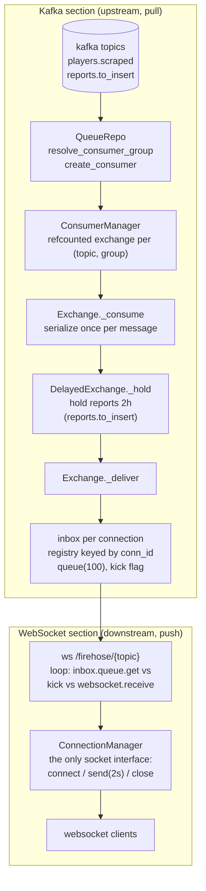
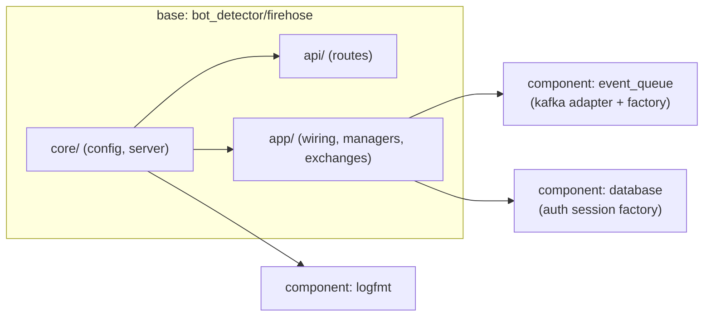

# firehose

Streams kafka messages over a websocket. One shared kafka consumer per topic and consumer group, fanned out to websocket clients.

## Architecture

Two sections, separated by `asyncio.Queue` handoffs. The kafka section only knows queues; the websocket section only knows queues and sockets.

- every connection gets an inbox under its `conn_id`; the route fetches it via `exchange.get_inbox(conn_id)` and delivers each message through `ConnectionManager.send` (bounded, close on timeout)
- the exchange never touches sockets: a full inbox just sets the kick flag; the route closes the socket and unsubscribes

### Backpressure and lifecycle

- First subscriber: `ConsumerManager.create` builds, registers and starts the exchange; `get` refcounts +1.
- Last subscriber leaves: `ConsumerManager.release` drops the refcount, `delete` stops and unregisters the exchange (consumer_manager.py).
- Slow client: a full inbox (100) sets the kick flag; the route closes the websocket (1013) and unsubscribes; the others keep streaming (`firehose_kicked_total`).
- Failing or too-slow send: the route closes the connection the same way (a cancelled send can leave a partial frame; never retry).
- No subscribers left: the consume loop stops; kafka retains the stream until a client connects.
- Two tabs on one user group: each gets a copy (fan-out per connection).

## Dependency flow

Deployed by `projects/firehose`.

## Endpoints

| Endpoint | Type | Auth | Description |
|---|---|---|---|
| `/firehose/{topic}` | websocket | api key, `?token=`, or anonymous | Stream a topic |
| `/firehose/topics` | GET | none | List allowed topics |
| `/me` | GET | api key / discord | Caller identity |

Topics: `players.scraped` (live), `reports.to_insert` (delayed 2h by `DelayedExchange`).
