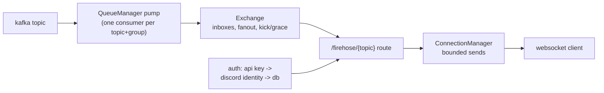

# firehose

Streams kafka messages over websockets. Anonymous users share a group
per topic; authenticated users get their own group.

## Architecture



Dependency flow: `bases/bot_detector/firehose` imports
`components/bot_detector/event_queue` (kafka adapter),
`components/bot_detector/database` (api users), and
`components/bot_detector/logfmt`. Nothing imports the base.

Key policy: a full inbox drops messages while the connection is inside
its join grace (`KICK_GRACE_S`, default 30) and kicks it (close 1013)
once the grace is over - but a lone subscriber is never kicked; the
pump waits instead. `reports.to_insert` streams `delay_s` behind live
(the DelayAdapter holds each message until its `report.ts` is old
enough).

## How to test this base

Four layers, cheapest first. Each layer is real product code; the
fakes shrink as the layer grows.

### 1. Unit tests (seconds)

```sh
uv run pytest test/bases/bot_detector/firehose -q
```

Exchange semantics, queue manager, connection manager, api routes.

### 2. DST scenarios (seconds, deterministic, virtual time)

The whole app on a simulated clock: sleeps, kicks, outages and a
simulated day replay byte-identically per seed.

```sh
# steady state: parity across clients, no kicks
uv run python -m dst.main dst.scenarios.firehose \
    --kw duration_s=60 --kw feed_rate_s=500 --kw n_clients=5 --json-pretty

# staggered joins into a hot feed: grace drops, kick waves
uv run python -m dst.main dst.scenarios.join_storm --json-pretty

# keyed users isolated from a degrading anonymous fleet
uv run python -m dst.main dst.scenarios.keyed --json-pretty

# the 2h emission delay over a simulated day (note --start: epoch clock)
uv run python -m dst.main dst.scenarios.reports_delay \
    --start 2000000000 --json-pretty

# broker outage: pump backs off, arrivals queue, stream resumes
uv run python -m dst.main dst.scenarios.firehose \
    --kw outage_at_s=5 --kw outage_duration_s=8 --json-pretty
```

Unit + scenario tests together:

```sh
uv run pytest test/bases/bot_detector/firehose test/development/dst -q
```

### 3. Container smoke (minutes, real stack)

Real kafka, real uvicorn, real websockets, the production container:

```sh
make smoke-firehose           # parity, slow client, stalled kick, cleanup
make smoke-firehose-hunt      # starvation hunt: 12 clients, paced feed
make smoke-firehose-resilience  # bounce kafka + restart firehose mid-stream
```

The resilience run proves aiokafka reconnects through a broker bounce
(clients never drop), and that clients reconnect through a firehose
restart with at-least-once delivery and no loss.

## What each layer cannot see

- DST cannot see uvicorn/websockets/TCP or real kafka group behavior
  (by design: fakes replace the transport). Its value is determinism.
- The container smoke cannot see wall-clock profiles or past runs; it
  is a live check, not a replay.
