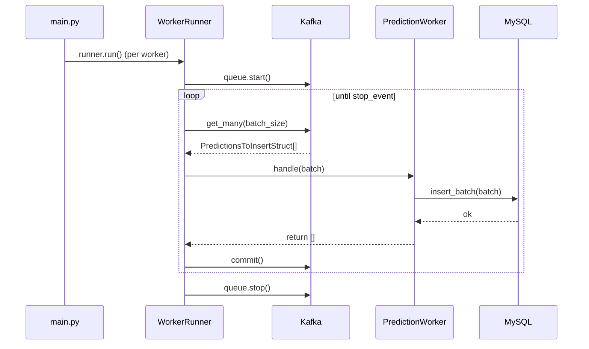

# worker_prediction

Consumes ML prediction messages from the `predictions.to_insert` Kafka topic and inserts them into the `prediction` and `prediction_latest` tables.

## Architecture

```
┌─────────────┐
│   main.py   │  wiring & lifecycle
├─────────────┤
│  settings.py│  pydantic-settings (N_WORKERS, MAX_BATCH_SIZE, MAX_INTERVAL_MS)
├─────────────┤
│  worker.py  │  PredictionWorker.handle() + insert_batch()
└─────────────┘
```

### Dependency flow

```
main.py
  → worker component (WorkerRunner)
  → database component (PredictionRepo, PredictionLatestRepo, session factory)
  → event_queue component (KafkaConfig, PredictionsToInsertStruct)
```

## Flow

1. `main()` creates `N_WORKERS` instances of `PredictionWorker`, each wired to a `WorkerRunner`.
2. Each `WorkerRunner` creates a Kafka queue (consumer + producer), starts it, and enters the consume loop.
3. On each iteration, `WorkerRunner` fetches a batch of `PredictionsToInsertStruct` messages from Kafka.
4. `PredictionWorker.handle()` inserts the batch into `prediction` + `prediction_latest` via `insert_batch()`.
5. On success, `WorkerRunner` commits the Kafka offset.
6. On failure, `WorkerRunner` requeues the batch and retries.

## Sequence diagram



## Configuration

| Variable | Default | Description |
|---|---|---|
| `N_WORKERS` | `1` | Number of parallel worker instances |
| `MAX_BATCH_SIZE` | `10_000` | Max messages fetched per consume iteration |
| `MAX_INTERVAL_MS` | `1_000` | Kafka consumer timeout in milliseconds |
| `METRICS_PORT` | `8000` | Prometheus metrics port |
