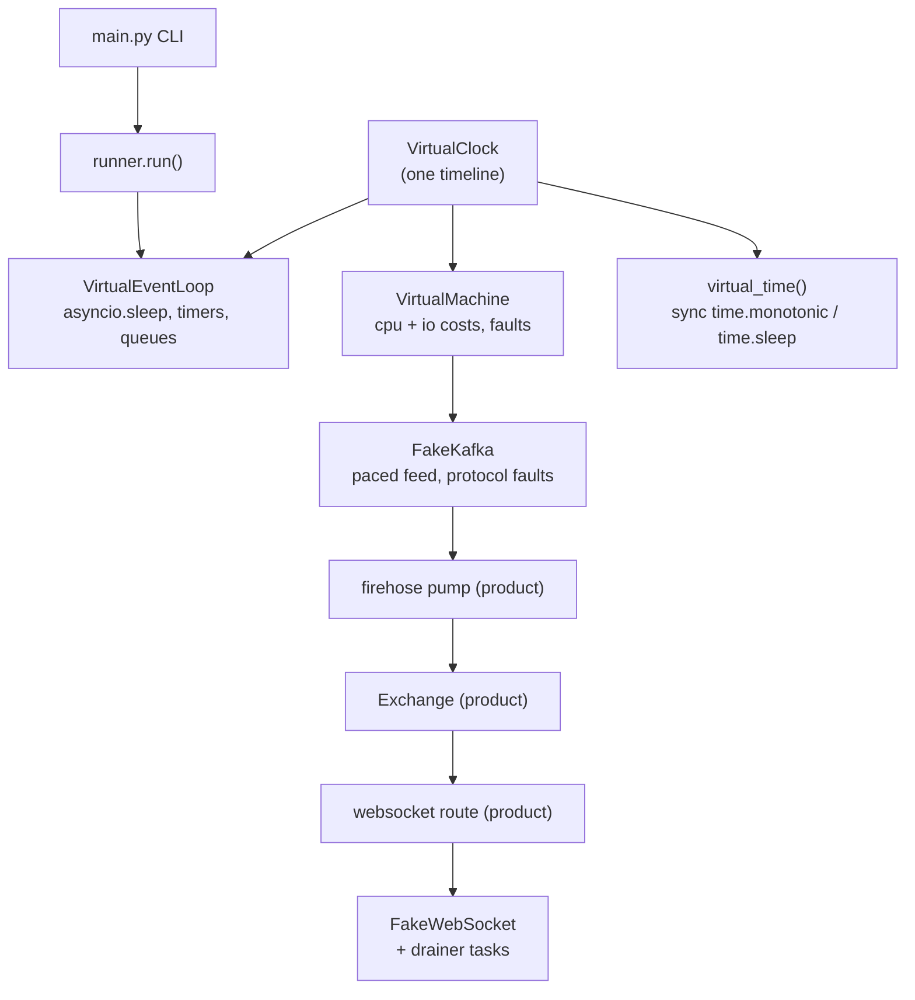

# DST: deterministic simulation toolkit

DST runs long-lived async systems in simulated time. A scenario that
covers a simulated day finishes in milliseconds of wall time. Every
run replays: the same seed and the same arguments give the same
result, down to individual messages, kicks, and close codes.

The toolkit lives under `development/` and imports the product. The
product never imports DST.

## Layout

```
development/dst/
├── README.md
└── src/dst/         importable as `dst` (development/dst/src is on sys.path)
    ├── __init__.py
    ├── clock.py         VirtualClock: the one source of simulated time
    ├── loop.py          VirtualEventLoop: asyncio on the clock
    ├── machine.py       VirtualMachine: cpu, io costs, fault injection
    ├── timepatch.py     virtual_time(): sync time module patch
    ├── runner.py        run(): drive a scenario, return a SimResult
    ├── main.py          CLI launcher
    ├── systems/         simulated outside world
    │   ├── fake_kafka.py
    │   └── fake_firehose_clients.py
    └── scenarios/       product-on-DST wiring, one module per app
        ├── kafka_smoke.py
        └── firehose.py
```

`development/dst/src` is on the import path for pytest (pytest.ini
`pythonpath`), for pyright (`pyrightconfig.json` `extraPaths`), and at
runtime through `_bot_detector.pth` in the venv site-packages.

## Architecture



### How the parts work

- **VirtualClock** holds one float of seconds. `advance` moves by a
  relative amount. `advance_to` jumps to a deadline. Time never moves
  backwards.
- **VirtualEventLoop** subclasses `BaseSelectorEventLoop` and changes
  two things. `time()` reads the clock, so `asyncio.sleep(3600)` costs
  one O(1) clock jump. `_run_once` never polls for network events.
  When no callback is ready, it jumps the clock to the next timer.
- **DSTIdleError** replaces the blocked select. A task parked on a
  real socket, an unset future, or a missing simulated system can
  never proceed on a simulated timeline. The loop raises instead of
  waiting, so scenarios fail fast and name the cause.
- **VirtualMachine** models the box. `await machine.cpu(cost)` runs
  compute work on one serial core that handles 1.0 cpu-second per
  virtual second. Costs queue up, so a pump that spends 0.0002s per
  message sustains at most 5,000 msg/s and falls behind a faster feed.
  `await machine.io(system)` draws a latency from a profile and can
  fail with a seeded probability. Faults are percentage-based stalls
  in the shape of a garbage-collection pause.
- **virtual_time()** patches `time.monotonic`, `time.time`, and
  `time.sleep` onto the clock. Use it for sync code and for product
  code that reads the wall clock (timers, grace windows).
- **Systems** stand in for the outside world. Errors arrive as values,
  never as raises, and every draw comes from one seeded RNG in a fixed
  order. A fake kafka returns broker errors, poison payloads, and slow
  fetches. The firehose fleet models fanout, grace drops, and kicks
  with close code 1013.
- **Scenarios** patch the I/O seams of a product and run the real code
  unmodified. The firehose scenario replaces `QueueRepo.create_consumer`
  with the fake kafka and drives the real websocket route through
  `FakeWebSocket`. It never starts uvicorn and never opens a socket.
- **run()** ties it together. It builds the loop, runs the scenario,
  cancels leftovers, and returns a `SimResult` with virtual time, wall
  time, the return value, the error, and leaked task names.

## Usage

Run a scenario from the CLI:

```sh
# zero-wiring target: pure asyncio code
uv run python -m dst.main dst.scenarios.kafka_smoke \
    --kw duration_s=20 --kw feed_rate_s=250

# the real firehose app: 60 simulated seconds, 5 clients
uv run python -m dst.main dst.scenarios.firehose \
    --kw duration_s=60 --kw feed_rate_s=500 --kw n_clients=5 --json-pretty
```

The target is `module[:function]`. The function defaults to `main` and
must be a coroutine function. `--kw k=v` values parse as JSON, with a
plain string as fallback. `--until` sets a virtual-time deadline for a
scenario that never ends on its own. Exit code is 0 only for a
completed scenario. Output is one JSON object.

Use the toolkit from a test:

```python
import dst

result = dst.run(my_scenario(), until_s=3600)
assert result.done
assert result.value.backlog > 0
```

## Writing a scenario

1. Create a module under `development/dst/src/dst/scenarios/`.
2. Expose `async def main(**kwargs)` that returns a pydantic report.
3. Patch each I/O seam of the product to a DST system.
4. Wind down: close sockets, stop feeds, then return the report.

Run it twice with the same arguments and compare the reports. Equal
reports prove the replay. A difference names the nondeterminism.

## Rules and known traps

- Construct `VirtualMachine`, `FirehoseHub`, and fakes inside the
  scenario coroutine. They bind to the clock of the running loop.
  Outside `dst.run`, pass a clock explicitly.
- The scenario body decides when `virtual_time()` applies. Product
  code that reads `time.monotonic` needs the patch active.
- Dataclass default factories capture the real `time.monotonic` at
  import time in a closure cell. `Inbox.subscribed_at` needed a cell
  rebind (see `_virtualize_inbox_clock` in the firehose scenario).
  A grace window that never closes is the symptom.
- `FakeKafka.get_one` counts a draw before it reads the queue, so
  `consumed_total` includes fault draws. Backlog never goes negative.
- One `virtual_time()` block at a time. The patch is global to the
  process. Nesting raises.

## Testing

```sh
uv run pytest test/development/dst -q
```

The suite covers the clock, the loop, the machine, both systems, the
launcher, and both scenarios. It asserts parity, ordering, kick
policies, fault replay, and end-to-end determinism of the firehose
scenario.
