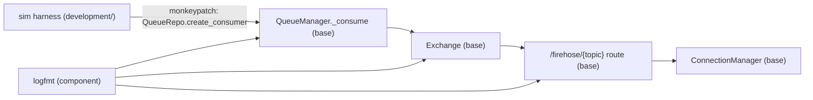

# Deterministic run analysis

Date: 2026-09-30. Scope: seeded (deterministic) runs of the firehose perf framework, with
logfmt `TO_FILE` capturing server logs for post-run analysis. Supersedes the retired
scenario docs (`perf_analysis.md`, `smoke_analysis.md`; their pre-join-grace numbers
live in git history).

Status: F1 (sim log gate), F3 (orjson), F4 (grace-drop counter) and F6 (task cleanup,
fast tests) are implemented. F2 (starvation investigation) and F5 (task-churn
optimization) are intentionally deferred, per their YAGNI verdicts.

## Runs executed

| Run | Command (repo root) | Result |
|---|---|---|
| unit | `uv run pytest test/development/perf/firehose test/bases/bot_detector/firehose -q` | 85 passed (9 warnings, see F6) |
| smoke replay 1 | `TO_FILE=/tmp/.../run1.log uv run python -m development.perf.firehose.smoke --seed 42 --port 5114 --metrics-port 8114` | 13/14 FAIL: `slow_clients_received` |
| smoke replay 2 | same seed, ports 5116/8116 | 14/14 PASS |
| perf 500/s seeded | `TO_FILE=/tmp/.../perf.log uv run python -m development.perf.firehose run --n 20 --duration 25 --rate 500 --seed 42 --error-pct 0.02 --poison-pct 0.1 --verbose` | 0 kicks, 157,080 delivered |

## Determinism results (seed 42, twice)

| Signal | Replay 1 | Replay 2 | Replays exactly? |
|---|---|---|---|
| feed/fault stream | seeded | seeded | yes (unit-tested byte-equality) |
| kicks_counted | 16 | 16 | yes |
| healthy parity | 492 x12 fast | 489-490 x12 fast | ±3 msgs |
| ordering | 17/17 | 17/17 | yes |
| cleanup gauges | all 0 | all 0 | yes |
| slow clients | `[492,492,0,492,492]` FAIL | 489 x5 PASS | **no** |

Conclusion, consistent with the DST scorecard (seed replay: partial): the seeded
feed/fault pipeline replays; the remaining nondeterminism is OS scheduling in the
transport layer, and it surfaced as the known single-victim starvation (replay 1):

```text
slow: msgs= 0 kicked= False close= None error='client task did not finish' order_ok= True
```

Server side was clean in the same run (`no_zombie_inboxes`, `connections_cleaned`,
`no_server_crash` all PASS): the server believes it delivered; the client saw zero
bytes. Same signature as `findings.jsonl` (open issue). Post-implementation
verification runs struck slow and fast clients alike — the victim is any single
connection, not a client class. The flake rate makes the smoke suite unreliable
until this is root-caused — see F2.

## Perf result at 500/s (seeded, faults on)

All 20 clients survived at near-exact parity: 7,853-7,855 msgs each (314/s per client,
6,283/s aggregate deliveries, 0 kicks). The pre-join-grace baseline at the same rate
(retired scenario doc): 13/20 kicked, 3,458/s aggregate via 7 survivors.

Two economics facts from the numbers:

- Pump consumed ~314 msg/s (deliveries / 20 subscribers), below the 500/s feed: ~4.6k
  msgs accrued as broker-side backlog in 25 s. Spec-conformant (kafka retains), and now
  the *normal* overload shape: shared slowdown, not kicks.
- Faults: 15 skip-warnings in the TO_FILE log; 15 x 0.5 s = 7.5 s of pump sleep in a
  25 s window (30% duty loss). `error_pct=0.02` is percent-of-draws, i.e. ~1.9 expected
  errors + ~7.9 poison at this consumption — 15 observed is binomial noise (~1.8 sigma),
  and the seeded stream replays regardless.

With `kick_grace_s` (default 30 s) exceeding the run, the old ramp massacre is gone:
F2 (ramp massacre) is fixed in code. **Pre-join-grace scenario tables are historical** —
post-grace behavior is: shared pump-throughput slowdown, not kicks.

## Findings

### F1 — SIM_VERBOSE gate silences the exact evidence TO_FILE is meant to capture

With the smoke suite (SIM_VERBOSE off), `TO_FILE` captured exactly 1 line in 25 s:
the payload-pool INFO from the harness namespace. Every kick warning, every
"skipping message" warning is suppressed:

```python
# bases/bot_detector/firehose -> development/perf/firehose/sim_server.py (serve)
if not verbose:
    # app logs (connects, evictions) flood the terminal; the counts
    # are on the dashboard instead
    logging.getLogger("bot_detector").setLevel(logging.ERROR)
```

Two problems: (a) `WARNING` is operational signal, not chatter — kicks, poison skips;
(b) the gate targets the `bot_detector` namespace, while harness loggers live under
`development.perf.*` and always log at root level — so the gate suppresses the product
and keeps the harness. The kick log itself is good (F7 instrumentation landed:
`bases/bot_detector/firehose/app/exchange/core.py`):

```python
logger.warning(
    f"kicking inbox conn_id={inbox.conn_id} group={inbox.group} "
    f"qsize={inbox.queue.qsize()} age_s={inbox.age_s:.1f}"
)
```

Proposed (3 lines, keep INFO chatter gated):

```python
if not verbose:
    # WARNING+ (kicks, skipped poison) stays in logs/TO_FILE; verbose
    # adds the INFO chatter (connects, queue lifecycle)
    logging.getLogger("bot_detector").setLevel(logging.WARNING)
```

YAGNI verdict: do it — the analysis pipeline is broken without it, and the fix is the
smallest possible change.

### F2 — Single-victim starvation is the last real defect; investigate minimally

Reproduced on seed 42 (replay 1), victim a slow client: 0 msgs, no close frame, client
task hung; server gauges clean. Prior occurrences: victim indices 13, 16, 15, now
slow-idx 2 — never seed-correlated, always exactly one client. Suspect remains the
uvicorn websockets_impl / legacy client send path.

Proposed next step (not a fix, an experiment): a 2-client minimal repro (1 fast + 1
slow, 200/s, no fleet) to isolate whether the fleet/burst is required. If it
reproduces, capture `asyncio.all_tasks()` await-chains (the `/sim/debug` machinery
already exists) at the moment of starvation.

Explicitly rejected (YAGNI): server-side retransmit/redelivery, per-client delivery
timeouts, or widening the harness with more instrumentation. The defect is below the
app's ASGI boundary; app-level machinery cannot see it, so build none until the
minimal repro points at a layer.

### F3 — logfmt details: stdlib json, non-ISO timestamps, append-mode TO_FILE

```python
# components/bot_detector/logfmt/core.py
import json  # repo standard is orjson
...
return json.dumps(log_record, default=str)
```

```python
file_handler = logging.FileHandler(settings.TO_FILE)  # append mode
```

Consequences seen in this session: (a) violates the repo orjson standard — proposed:

```python
import orjson
...
return orjson.dumps(log_record, default=str).decode()
```

(b) `ts` is `"2026-09-30 22:39:47,727"` — fine for humans; ISO-8601 would make
log-diff tooling easier, but nothing in the repo parses it yet (YAGNI: leave).
(c) append mode mixes runs when the same path is reused across replays. Proposed:
workflow guidance only — pass a per-run path
(`TO_FILE=/tmp/firehose_$(date +%s).log`) — no rotation logic in logfmt until a real
operator need appears (YAGNI).

YAGNI verdict: orjson swap is a 2-line consistency fix (do); rotation is not needed.

### F4 — Grace-period drops are invisible

Within `kick_grace_s` (default 30 s) a full inbox silently drops messages
(`Exchange.send` / `send_or_wait` drop path), and the sole-subscriber wait path drops
during grace too. At 500/s a client inside its grace can silently lose minutes of
stream. Kicks are counted (`firehose_kicked_total`); grace drops are not — the one
observability hole left in the kick/loss story.

Proposed (one counter, mirroring the existing metric pattern):

```python
# bases/bot_detector/firehose/app/metrics.py
FIREHOSE_DROPPED = Counter(
    "firehose_dropped_total",
    "messages dropped instead of kicking (join grace)",
    ["topic", "type"],
)
```

incremented in the two `QueueFull` drop branches of `Exchange`. YAGNI verdict:
borderline — add it only if grace-period loss ever needs auditing in prod; the code
change is one counter plus two `.inc()` calls, so the cost of being wrong is tiny.

### F5 — Per-message task churn in Inbox.get_message

Every message allocates two tasks and cancels one:

```python
# bases/bot_detector/firehose/app/exchange/structs.py
get_task = asyncio.create_task(self.queue.get())
kick_task = asyncio.create_task(self.kick.wait())
...
for task in pending:
    if task is not disconnect:
        task.cancel()
```

Proposed (deferred, sketch only): create the kick waiter once at subscribe and reuse
it until it fires:

```python
@dataclass
class Inbox:
    ...
    kick_wait: asyncio.Task  # kick.wait(), created in subscribe()

async def get_message(self, disconnect=None):
    get_task = asyncio.create_task(self.queue.get())
    wait = {get_task, self.kick_wait}
    if disconnect is not None:
        wait.add(disconnect)
    ...
```

YAGNI verdict: defer. Measured capacity is ~314 msg/s consumed x N subscribers
with churn included, production feed is below that (the 200/s smoke shows exact
parity), and the pump's loop-turn economics (the pump yield fix) dominate. This
becomes worth doing only if pump consumption must exceed ~1k msg/s. Correctness note
that keeps it safe to defer: the current code is race-clean after the
message-over-disconnect priority fix (see `findings.jsonl` 23:05/23:06).

### F6 — Test-hygiene warnings in the unit suite

`uv run pytest` reports 9 `PytestUnraisableExceptionWarning: Event loop is closed`
from `asyncio/queues.py` — tests finish with tasks still parked on `queue.get()`.
Production code is not implicated. Proposed: a fixture that gathers/cancels leftover
tasks per test. YAGNI verdict: cheap hygiene; no architectural weight.

## Architecture assessment



What the results say about the structure:

1. **The seams are right.** The harness only patches one method
   (`QueueRepo.create_consumer`) and everything else — pump, exchange, routes,
   connection manager, metrics — is production code under test. The smoke suite
   asserts protocol facts (close 1013, ordering, handshake rejects, cleanup gauges),
   not implementation details. Keep this boundary.
2. **Considered and rejected: routing the sim through the `event_queue` memory
   adapter.** `InMemoryConsumerAdapter` has no rate control, no seeded fault
   injection, no backlog gauges. Moving the harness onto it means growing a shared
   component for harness-only needs — a YAGNI violation. `FakeKafkaConsumer` stays in
   `development/`.
3. **Considered and rejected: full DST rig** (virtual clock, single-process
   scheduler). The only nondeterminism left after seeding is the transport-level
   starvation (F2). A deterministic-scheduler rebuild of the whole fleet is a large
   investment to chase one stack-level issue; the minimal repro is the proportionate
   step.
4. **Overload behavior changed character — docs must catch up.** With the join grace +
   last-subscriber rule + single-yield pump, sustained overload now manifests as
   shared pump throughput (~314 msg/s consumed, kafka retains the rest), not client
   massacres. The pre-grace scenario docs were retired with this analysis; their
   numbers describe superseded behavior and live in git history.
5. **logfmt placement is correct** (component, imported once per base for root
   config); its issues (F3) are detail-level, not structural.

## Reproducing

```sh
# unit + regression tests
uv run pytest test/development/perf/firehose test/bases/bot_detector/firehose -q

# smoke replays (compare reports; same seed must agree except F2)
TO_FILE=/tmp/firehose_r1.log uv run python -m development.perf.firehose.smoke \
    --seed 42 --port 5114 --metrics-port 8114
TO_FILE=/tmp/firehose_r2.log uv run python -m development.perf.firehose.smoke \
    --seed 42 --port 5116 --metrics-port 8116

# seeded perf run with full log capture (verbose keeps WARNING+)
TO_FILE=/tmp/firehose_perf.log uv run python -m development.perf.firehose run \
    --n 20 --duration 25 --rate 500 --seed 42 --error-pct 0.02 --poison-pct 0.1 \
    --port 5118 --metrics-port 8118 --verbose
```

Note: pass a fresh `TO_FILE` path per run — the handler appends (F3).
